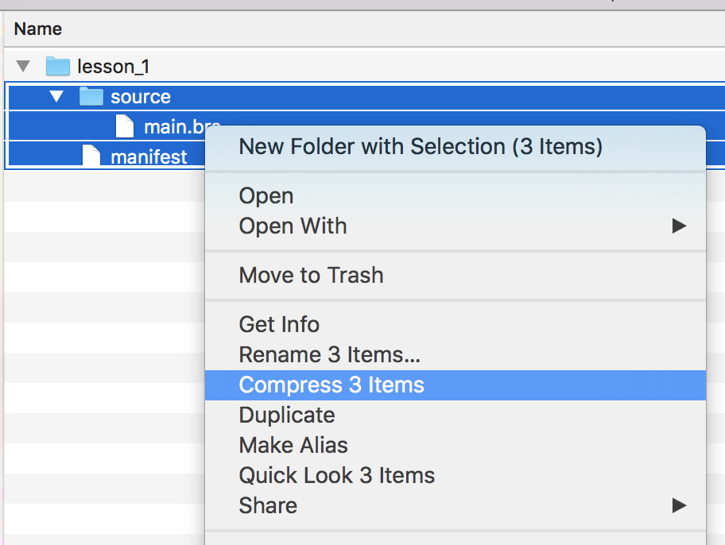
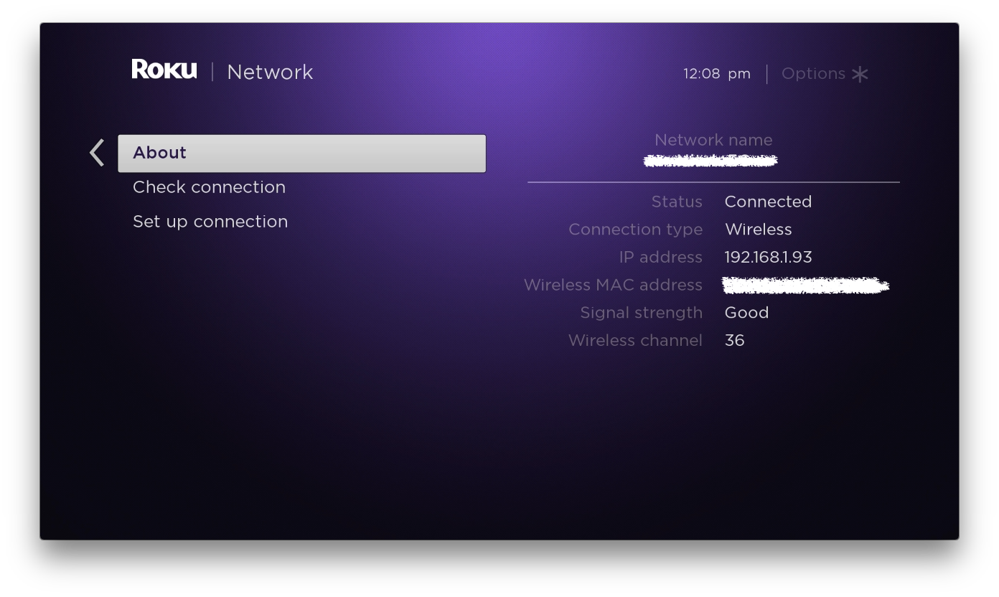
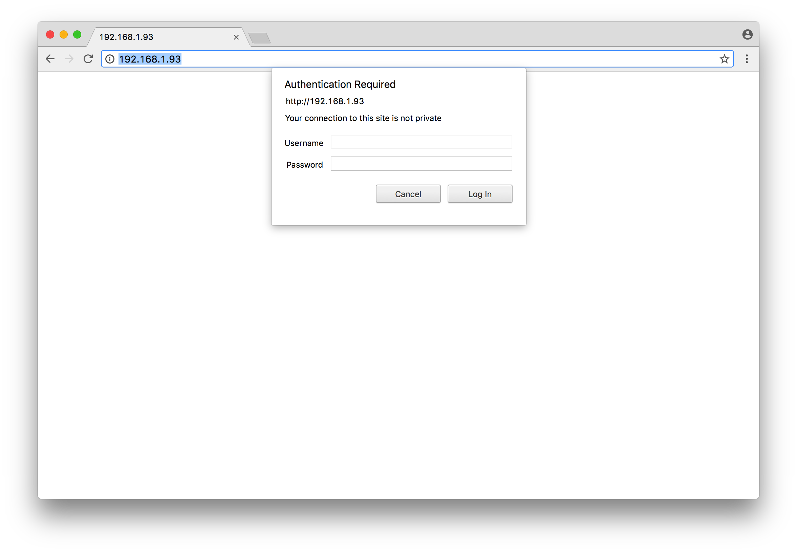
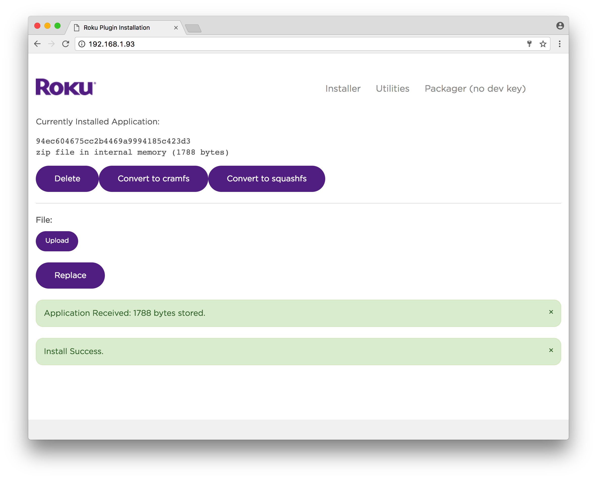
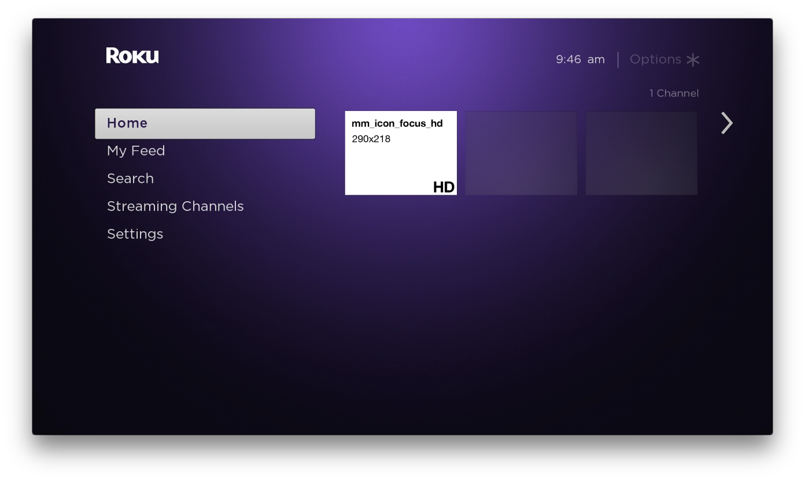

# Lesson 1
## Debugging, Sideloading, and Manifest

This lesson covers the core requirements to define and run a Roku app. It also covers some of the APIs available to gather information about the device.  
OK, let's go:

1. Create a directory called `lesson_1`, navigate into it  

1. Create a directory called `source`, navigate into it  

1. Create a file called `main.brs`, open the file, add this code:  
    ```
    sub main()
    ? "Hello World."  
    end sub
    ```
    You have now written a Roku application in the BrightScript programming language. Let's get it to run...   

1. Navigate back into the `lesson_1` directory  

1. Create a file called `manifest`, with no file extension  

1. Edit `manifest` to include this line, note the pound (#) sign  
    ```
    # This is here because this file must be larger than zero bytes.
    ```  

1. Now zip up the _contents_ of lesson_1 (the `manifest` file must be in the root of your zip)  
      

1. For the next steps, you will need the Roku's IP address. On your Roku, navigate to *System > Network > About*  
      

1. Before you upload (aka "sideload") this app to the device, go ahead and open a debugging session.  
    Open Terminal/shell and enter the telnet command:  
    `$ telnet <roku ip> 8085`  
    for example, if your Roku's IP is 192.168.1.93, you will see this:
    ```
    $ telnet 192.168.1.93 8085
    Trying 192.168.1.93...
    Connected to roku.
    Escape character is '^]'.
    ```
    To exit the telnet session, press `CTRL` + `]`, then type `q` at the `telnet>` prompt.  
    You will live and breathe the telnet session as you develop Roku apps. Get familiar with it.  
    More info: https://sdkdocs.roku.com/display/sdkdoc/Debugging+Your+Application  

1. Open a web browser and navigate to your Roku's IP address. You will need to use the credentials you set up when you registered the device for dev mode.  
      

1. Enter the user/pass, and upload the zip you just made  
    

1. Watch the telnet session update as the app launches:  
    ```
    ------ Compiling dev '' ------
    11-20 23:06:17.814 [scrpt.cmpl.time] Compiled '', id 'dev' in 0 milliseconds
    11-20 23:06:17.816 [ui.frm.plugin.running.enter] Entering PLUGIN_RUNNING for dev
    11-20 23:06:19.245 [scrpt.run.enter] UI: Entering '', id 'dev'  
    ------ Running dev '' main ------
    Hello World.
    ```
    Congratulations, you just launched your first Roku application! Take a break, you earned it.  

1. Notice how there are no visual elements on screen to represent the application. Let's add them.  Edit the  `manifest` file to include the following:
    ``` bash
    ## Channel Icons
    #### Image size for mm_icon_focus_hd: 290x218px
    mm_icon_focus_hd=pkg:/images/channel_logo_hd.png

    ###  Splash Screen + Loading Screen Artwork
    #### Image size for splash_screen_hd: 1280x720px
    splash_screen_hd=pkg:/images/splash_hd.png
    ```
    Zip and deploy the application again. You should briefly see the splash screen, defined in the line `splash_screen_hd=pkg:/images/splash_hd.png`:  
    <kbd></kbd>  

    On the Home Screen, notice the channel logo defined in the line `mm_icon_focus_hd=pkg:/images/channel_logo_hd.png`:  
    <kbd></kbd>  
    

1. Edit the manifest again, adding some custom details for the application. The next step will demonstrate how to leverage it.
    ``` bash
    ##   Channel Details
    title=Roku Lesson 1
    major_version=1
    minor_version=0
    build_version=0

    ## Channel Icons
    #### Image size for mm_icon_focus_hd: 290x218px
    mm_icon_focus_hd=pkg:/images/channel_logo_hd.png

    ###  Splash Screen + Loading Screen Artwork
    #### Image size for splash_screen_hd: 1280x720px
    splash_screen_hd=pkg:/images/splash_hd.png

    ### Custom value, defined by you.
    custom_field=hello_world
    ```

1. Now update the main function in the `source/main.brs` file:
    ```
    sub main()
        ' Print information from Roku manifest
        app_info = createObject("roAppInfo")
        ? "App Title: ", app_info.getTitle()
        ? "App Version: ", app_info.getVersion()
        ? "Channel ID: ", app_info.getID()
        ? "isDev: ", app_info.isDev()
        ? "Custom Field: ", app_info.getValue("custom_field")
    end sub
    ```
    Run it an check the debugger:
    ```
    ------ Running dev 'Roku Lesson 1' main ------
    App Title:      Roku Lesson 1
    App Version:    1.0.0
    Channel ID:     dev
    isDev:          true
    Custom Field:   hello_world
    ```
    This code will print out the values defined in the manifest, using the `roAppInfo` API. There are multiple options available in the manifest for customizing the data available. For more information, read here: https://sdkdocs.roku.com/display/sdkdoc/Roku+Channel+Manifest

1. Continue to edit the `source/main.brs` file:
    ```
    sub main()
        ' Print information from Roku manifest
        app_info = createObject("roAppInfo")
        ? "App Title: ", app_info.getTitle()
        ? "App Version: ", app_info.getVersion()
        ? "Channel ID: ", app_info.getID()
        ? "isDev: ", app_info.isDev()
        ? "Custom Field: ", app_info.getValue("custom_field")
        ' Print information from device
        ? "- - - - - - - - - - - - - - - - "
        device_info = createObject("roDeviceInfo")
        ? "Model: ", device_info.getModel()
        ? "Display Name: ", device_info.getModelDisplayName()
        ? "Firmware: ", device_info.getVersion()
        ? "Device ID: ", device_info.getDeviceUniqueId()
        ? "Friendly Name: ", device_info.getFriendlyName()
        display_size = device_info.getDisplaySize()
        ? "Display Size: ", display_size.w;"x";display_size.h
        ? "UI Resolution: ", device_info.getUIResolution()
        ? "Video Mode: ", device_info.getVideoMode()
        ? "IP Address: ",device_info.getExternalIp()
    end sub
    ```
    This code will print out more information about the device, using the `roDeviceInfo` API:  
    ```    
    ------ Running dev 'Roku Lesson 1' main ------
    App Title:      Roku Lesson 1
    App Version:    1.0.0
    Channel ID:     dev
    isDev:          true
    Custom Field:   hello_world
    - - - - - - - - - - - - - - - -
    Model:          4630X
    Display Name:   Roku Premiere+
    Firmware:       298.00E04108A
    Device ID:      YR007C832727
    Friendly Name:  Roku Premiere+ - YR007C832727
    Display Size:    1280x 720
    UI Resolution:  <Component: roAssociativeArray> =
    {
        height: 1080
        name: "FHD"
        width: 1920
    }
    Video Mode:     1080p
    IP Address:     123.456.7.8
    ```

1. Again, edit the `source/main.brs` file and add an argument to the `main()` function:
    ```
    sub main(obj)
    	? obj
        ' Print information from Roku manifest
        app_info = createObject("roAppInfo")
        ... etc ...
    end sub
    ```
    This will print some more analytics describing how the app was launched:
    ```
    ------ Running dev 'Roku Lesson 1' main ------
    App Entry:      <Component: roAssociativeArray> =
    {
        instant_on_run_mode: "foreground"
        lastExitOrTerminationReason: "EXIT_UNKNOWN"
        source: "auto-run-dev"
        splashTime: "1600"
    }
    App Title:      Roku Lesson 1
    App Version:    1.0.0
    Channel ID:     dev
    isDev:          true
    Custom Field:   hello_world
    - - - - - - - - - - - - - - - -
    Model:          4630X
    Display Name:   Roku Premiere+
    Firmware:       298.00E04108A
    Device ID:      YR007C832727
    Friendly Name:  Roku Premiere+ - YR007C832727
    Display Size:    1280x 720
    UI Resolution:  <Component: roAssociativeArray> =
    {
       height: 1080
       name: "FHD"
       width: 1920
    }
    Video Mode:     1080p
    IP Address:     123.456.7.8
    ```
    Roku actually supports 2 entry point functions, `main` or `runUserInterface`. You must define one or the other for the app to launch. They both do the same thing, so take your pick. Personally, I prefer the concise mystery of tradition's `main`.
    Here's the documentation: https://sdkdocs.roku.com/display/sdkdoc/Development+Environment+Overview#DevelopmentEnvironmentOverview-EntryPoints

That's it for Lesson 1. At this point you should be familiar with the basics of the Roku workflow. Now would be a good time to get familiar with Atom and a deploy script or package. You will be sideloading the app many, many times for the remainder of your Roku career. If you want to use bash & curl, this script is a good one: https://stackoverflow.com/questions/45285806/programmatically-upload-roku-channel-without-eclipse-plugin/45405595#45405595  

Next Up: 
[Lesson 2: Screen, Components, and Resolution](Lesson2.md)  
