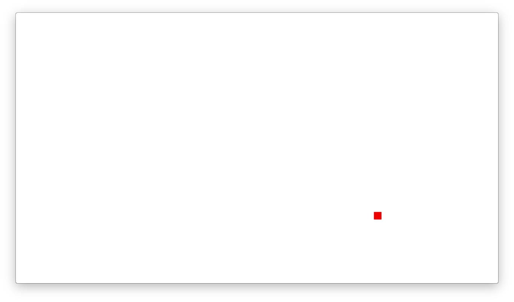
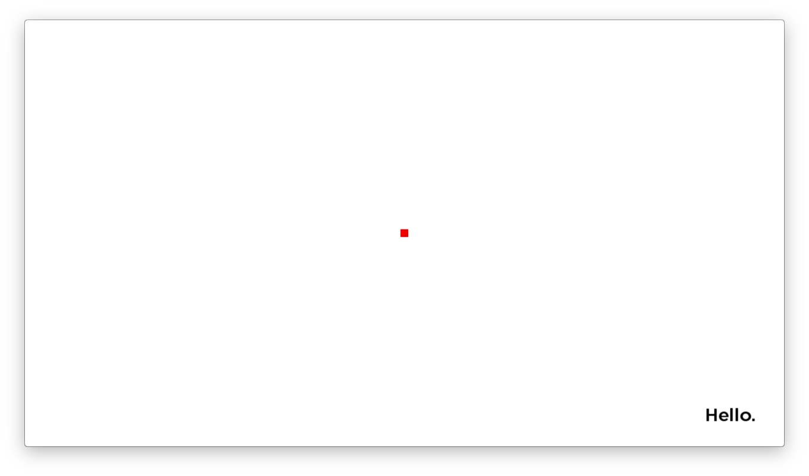

#  Lesson 2  
## Screen, Components, and Resolution

In this lesson we will add a screen to the application to demonstrate the fundamentals of SceneGraph.
Screens require 2 files, an XML file for the UI and a BrightScript (brs) file for the application logic. The convention is to use the same name for both, for example `myscreen.xml` and `myscreen.brs`. While it is legal to put the BrightScript code in the XML file, it is an awful thing to do. It is difficult to maintain and just ugly.

OK, let's go:

1. Create a directory called `components` in your project  

1. Add 2 files: `home_scene.xml` and `home_scene.brs`

1. Open `home_scene.xml` and add this code:
    ``` xml
    <?xml version="1.0" encoding="utf-8" ?>
    <component name="home_scene" extends="Scene">
        <script type="text/brightscript" uri="pkg:/components/home_scene.brs" />
    </component>
     ```
    Note the `<script>` tag. This is how you bind the UI to the logic. Also, this component extends `Scene`, a core component in the Roku  API. SceneGraph applications are intended to have one "Scene", and the visual screens are drawn as children of this component.  
    Read more here: https://sdkdocs.roku.com/display/sdkdoc/Scene

1. Open `home_scene.brs` and add this code:
    ```
    function init()
    	? "[home_scene] init"
    end function
    ```

1. Now run the application. This will appear in the debugger:
    ```
    ------ Running dev 'Roku Lesson 2' main ------
    [home_scene] init
    ```
    Every SceneGraph component must define an `init()` function. This is called by the firmware whenever an instance of the component is created.  

1. When you run the application, the splash screen appears, but the application immediately closes. We need to add logic to keep the app running until it is closed with the remote.  
The home_scene must be referenced by the application, so the main file needs updates. Navigate to `source/main.brs` and update it:
    ```
    sub main()
    	screen = createObject("roSGScreen")
    	scene = screen.createScene("home_scene")
    	screen.Show()
    end sub
    ```
    `screen` is a core component of a SceneGraph application, and there should only ever be one. The UI defined in the application will be attached to this screen.  
    `scene = screen.createScene("home_scene")` creates an instance of the component defined in `components/home_scene.xml`.  
    `screen.Show()` triggers the rendering of the components.  
    Continue to edit the file:
    ```
    sub main()
    	screen = createObject("roSGScreen")
    	scene = screen.createScene("home_scene")
    	screen.Show()
    	port = createObject("roMessagePort")
    	screen.setMessagePort(m.port)
    	' this loop is necessary to keep the application open
    	' otherwise the channel will exit when it reaches the end of main()
    	while(true)
    		' nothing happens in here, yet
    		' the HOME and BACK buttons on the remote will nuke the app
    	end while
    end sub
    ```
    `m.port` is an mechanism to read events from an object. When coupled with a loop, the application can capture information as the clock runs.  
    The `while` loop is, uh, strange. Fundamentally, this loop keeps the main() function open during the execution of the application. Keep in mind that the HOME button press on the remote will nuke your application without any warning or message.  
    Read more here:  
    https://sdkdocs.roku.com/display/sdkdoc/Event+Loops, https://sdkdocs.roku.com/display/sdkdoc/ifMessagePort

1. Run the application again. Now it stays open with a blank gray screen (this is the instance of home_scene) until you click the BACK button or HOME button.

1. Now add some visual components. In `components/home_scene.xml`, add the children node within the component definition.
    ``` xml
    <?xml version="1.0" encoding="utf-8" ?>
    <component name="home_scene" extends="Scene">
      <script type="text/brightscript" uri="pkg:/components/home_scene.brs" />
    <children>
        <Rectangle
          translation="[950, 530]"
          width="20"
          height="20"
          id="center_square"
          color="0xFF0000"/>
        <Label
          translation="[1720, 980]"
          id="label_hello"
          font="font:LargeBoldSystemFont"
          color="0x000000"
          text="Hello."/>
    </children>
    </component>
    ```
    Notice the `translation` attribute. This defines the [x,y] coordinates for  placement, where [0,0] is the top left of the screen. It is important to keep these values consistent for a single target resolution (for example, 1080p) throughout your application. Later on you will see how these values are interpreted by the device.  

1. Open `components/home_scene.brs` again and add this code:
    ```
    function init()
    	? "[home_scene] init"
    	m.top.backgroundURI = ""
    	m.top.backgroundColor = "0xFFFFFFFF"
    	m.center_square = m.top.findNode("center_square")
    	m.center_square.setFocus(true)
    end function
    ```
    Notice how the reference to the XML components is done. `m.top` refers to the component that is running this code.
    The background stuff sets the screen color to white. For some odd reason, in order for `backgroundColor` to work, the `backgroundURI` must be set to an empty string.
    In order to manipulate the objects in the component, you must define references using the `findNode()` API.  
    It is not entirely necessary to include `m.center_square.setFocus(true)`, but it is good to get in the habit of making the remote control focus explicit. SceneGraph depends on the focus being properly set for the remote control to work right. This becomes more important, and easier to mess up, as your application grows in complexity.  
    As for `m`, it's used for scope, similar to "this" in other languages. Refer to the docs:
    https://sdkdocs.roku.com/display/sdkdoc/Component+Architecture#ComponentArchitecture-Scope

1. To understand the coordinate system and how the Roku handles screen resolution, we need to return to the `manifest` file. Update the splash screen with a new entry for the splash_screen, `splash_screen_fhd`:  
    ``` bash
    ##   Channel Details
    title=Roku Lesson 2
    major_version=1
    minor_version=0
    build_version=0
    ## Channel Icons
    #### Image size for mm_icon_focus_hd: 290x218px
    mm_icon_focus_hd=pkg:/images/channel_logo_hd.png
    ###  Splash Screen + Loading Screen Artwork
    #### Image sizes are splash_screen_fhd: 1920x1080px | splash_screen_hd: 1280x720px
    splash_screen_fhd=pkg:/images/splash_fhd.png
    splash_screen_hd=pkg:/images/splash_hd.png
    ```
    <kbd></kbd>&nbsp;&nbsp;&nbsp;&nbsp;<kbd></kbd>  

    This image file is a 1920x1080 image used for high resolution UI displays.  If the Roku supports a 1080p UI, then this image is used for the splash screen.  It is important to make a distinction between the *UI resolution* and the *video playback resolution*. Until recently, most Roku devices used 1280x720/720p (aka HD) UIs, yet could playback video at a full 1080p. So the application interface, with the menus, information screens, etc was all 1280x720 no matter what the attached display could handle. Only when video playback began would the full 1920x1080/1080p (aka "Full HD", or FHD) resolution be used. The newer models, however, support 1080p UI resolution and 1080p and 4K video playback.  
    In order for the UI to render correctly on all devices, use the `ui_resolutions` manifest option the indicate what resolution the app was designed for.
    If there is no entry in the manifest, the default value is `sd,hd`. To indicate that the application is laid out using a 1920x1080 screen, the entry would be  
    `ui_resolutions=fhd`  

    For `fhd`, all the `translation` attributes defined in the SceneGraph components would be based on a 1080p resolution, and any other resolution will **scale automatically**.  If the value was `hd,fhd`, the Roku would assume the application logic would handle all scaling, and would not automatically adjust the layout between the different resolutions. In practice this would mean all of the components would have to read the device information, determine the available resolution, and adjust all the translations.
    Read more here: https://sdkdocs.roku.com/display/sdkdoc/Specifying+Display+Resolution  

1. To demonstrate, look at the code in `components/home_scene.xml`.
    ``` XML
    <Rectangle
      translation="[950, 530]"
      width="20"
      height="20"
      id="center_square"
      color="0xFF0000"/>
      ```  
    The coordinates place a 20x20 square dead center on a 1080p screen.
    Here's what the application looks like on a 720p device (Roku Stick 3500X) without the ui_resolutions manifest entry:  
      

    Now add the  `ui_resolutions=fhd` to the manifest:
    ``` bash
    ##   Channel Details
    title=Roku Lesson 2
    major_version=1
    minor_version=0
    build_version=0
    ## Channel Icons
    #### Image size for mm_icon_focus_hd: 290x218px
    mm_icon_focus_hd=pkg:/images/channel_logo_hd.png
    ###  Splash Screen + Loading Screen Artwork
    #### Image sizes are splash_screen_fhd: 1920x1080px | splash_screen_hd: 1280x720px
    splash_screen_fhd=pkg:/images/splash_fhd.png
    splash_screen_hd=pkg:/images/splash_hd.png
    #tell the Roku we designed our app for 1080p
    ui_resolutions=fhd
    ```
    and run the app:  
    

This is the end of Lesson 2.
