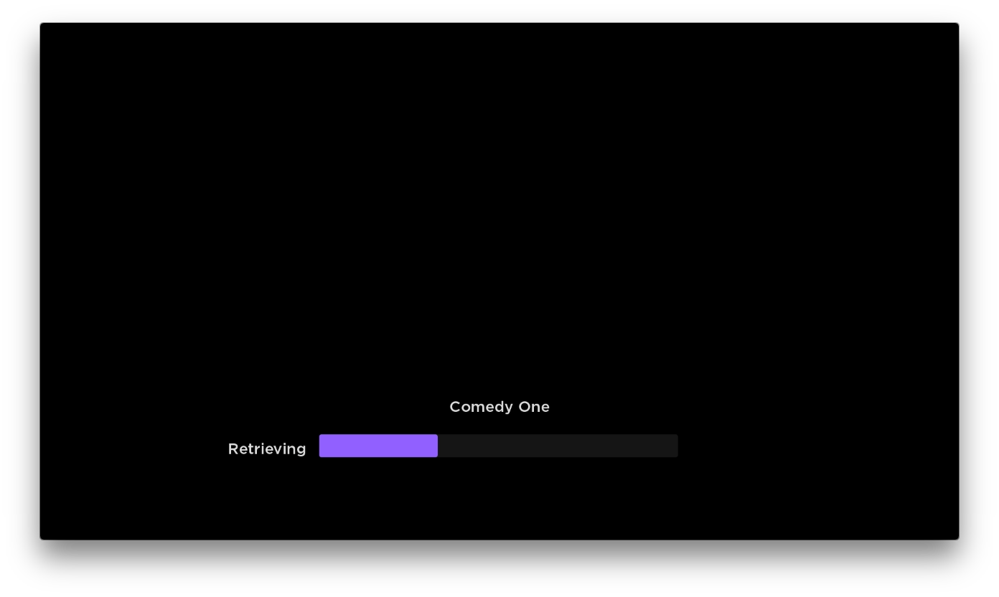
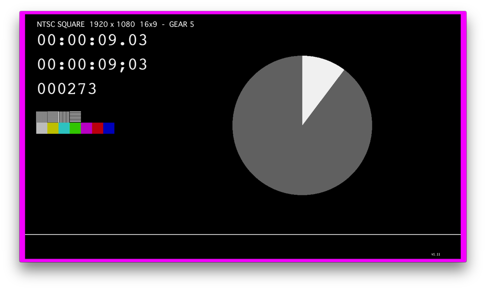
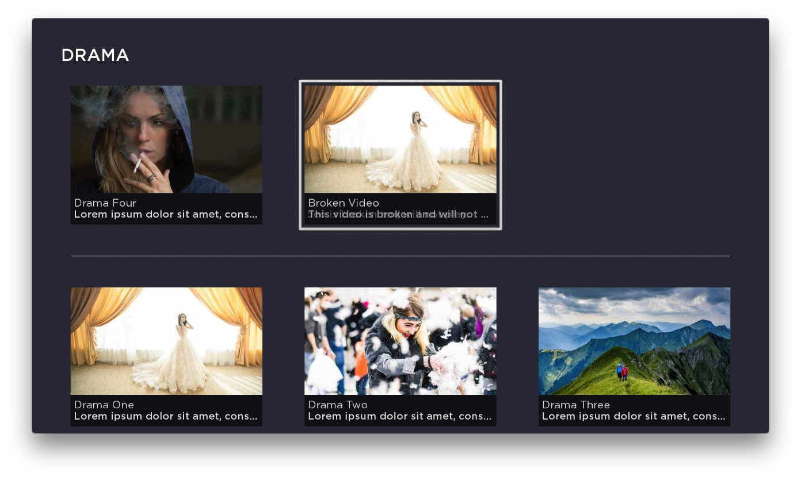
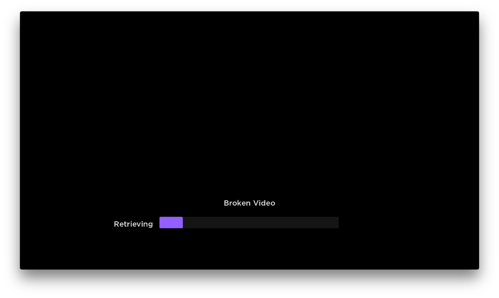
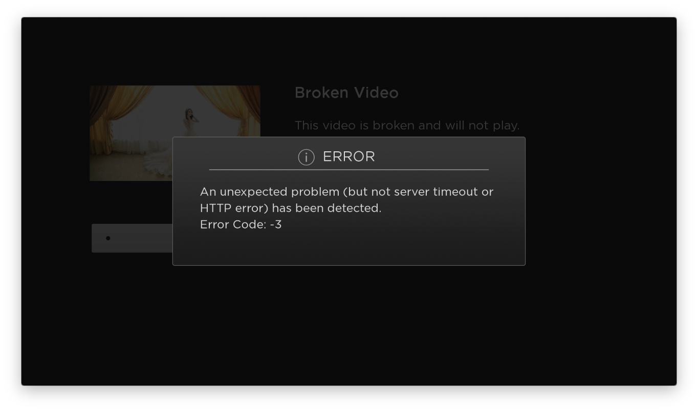

#  Lesson 6
## Video Playback, Dialogs
In this lesson, we update the app to play video and write an observer for the video events.  We'll also add error handling and a UI modal dialog to communicate the errors.
OK, let's go:

1.  The first step is enabling video playback. In `home_scene.brs`, update the content selection handler:
    ``` java

    sub onContentSelected(obj)
        selected_index = obj.getData()
        m.selected_media = m.content_screen.findNode("content_grid").content.getChild(selected_index)
        m.details_screen.content = m.selected_media
        m.content_screen.visible = false
        m.details_screen.visible = true
    end sub
    ```
    then update the play button handler:  

    ``` java

    sub onPlayButtonPressed(obj)
    	m.details_screen.visible = false
    	m.videoplayer.visible = true
    	m.videoplayer.setFocus(true)
    	m.videoplayer.content = m.selected_media
    	m.videoplayer.control = "play"
    end sub
    ```
    Remember that the content grid items are ContentNode instances. The Video node expects this node type when playing media. Look in `content_screen.brs` at the feed parser, and take note of the two fields `streamformat` and `url`.  These are required for the video to play successfully.  
    ``` JSON
    //feed item in server/roku_lessons/comedy.json
    {
        "id": "C123",
        "title": "Comedy One",
        "description": "Lorem ipsum dolor sit amet, consectetur adipiscing elit. Sed molestie velit sit amet rhoncus sodales. Suspendisse dignissim maximus mattis. Nullam ornare consectetur velit, ac pretium turpis. Nullam consequat ornare tincidunt",
        "thumbnail": "http://192.168.1.86:8888/roku_lessons/images/thumbnail-comedy1.jpg",
        "url":"https://devstreaming-cdn.apple.com/videos/streaming/examples/bipbop_16x9/bipbop_16x9_variant.m3u8",
        "streamformat":"hls"
    }
    ```
    ``` java

    node = createObject("roSGNode","ContentNode")
    node.streamformat = item.streamformat
    node.title = item.title
    node.url = item.url
    node.description = item.description
    node.HDGRIDPOSTERURL = item.thumbnail
    node.SHORTDESCRIPTIONLINE1 = item.title
    ```

    In the mock feeds provided in the `server/roku_lessons` directory, the video url value is a test HLS manifest hosted by Apple. So the node values will be:
    ```
    node.streamformat = "hls"
    node.url = "https://devstreaming-cdn.apple.com/videos/streaming/examples/bipbop_16x9/bipbop_16x9_variant.m3u8"
    ```

    Run the app and check out the video. This app relies entirely on the built-in UI for the loading screen and player controls.   
      

1. The next step is to add the Video node observers to `home_scene.brs`. To set up the video player to avoid frustrating errors, the code will also include some settings to ensure playback over HTTPS.  Add a new function and call it from `init()`:  

    ``` java
    function init()
    	? "[home_scene] init"
    	m.category_screen = m.top.findNode("category_screen")
    	m.content_screen = m.top.findNode("content_screen")
    	m.details_screen = m.top.findNode("details_screen")

    	m.videoplayer = m.top.findNode("videoplayer")
    	initializeVideoPlayer()

    	m.category_screen.observeField("category_selected", "onCategorySelected")
    	m.content_screen.observeField("content_selected", "onContentSelected")
    	m.details_screen.observeField("play_button_pressed", "onPlayButtonPressed")

    	m.category_screen.setFocus(true)
    end function

    sub initializeVideoPlayer()
    	m.videoplayer.EnableCookies()
    	m.videoplayer.setCertificatesFile("common:/certs/ca-bundle.crt")
    	m.videoplayer.InitClientCertificates()
    	m.videoplayer.observeFieldScoped("position", "onPlayerPositionChanged")
    	m.videoplayer.observeFieldScoped("state", "onPlayerStateChanged"
    end sub

    sub onPlayerPositionChanged(obj)
    	? "Player Position: ", obj.getData()
    end sub

    sub onPlayerStateChanged(obj)
    state = obj.getData()
    ? "onPlayerStateChanged: ";state
    end sub
    ```  

    When you run the app and play video, the debugger will show the state and position of the playhead. Notice how the position is not a whole number, but is reporting in fractions of a second:  

    ```
    onPlayerStateChanged: buffering
    onPlayerStateChanged: playing
    Player Position:                 0.222
    Player Position:                 0.729
    Player Position:                 1.233
    Player Position:                 1.741
    Player Position:                 2.249
    Player Position:                 2.755
    ```  

    Tracking playhead position is a key element of most analytics and advertising logic. For most applications, reading the playhead at each second is more useful than the default timing. The video node supports a property called `notificationInterval` for this reason. Update the `initializeVideoPlayer` function as follows:  

    ``` java
    sub initializeVideoPlayer()
    	m.videoplayer.EnableCookies()
    	m.videoplayer.setCertificatesFile("common:/certs/ca-bundle.crt")
    	m.videoplayer.InitClientCertificates()
        m.videoplayer.notificationInterval=1
    	m.videoplayer.observeFieldScoped("position", "onPlayerPositionChanged")
    	m.videoplayer.observeFieldScoped("state", "onPlayerStateChanged")
    end sub
    ```

    Run the app and note the welcome difference in the debugger:  

    ```
    onPlayerStateChanged: buffering
    onPlayerStateChanged: playing
    Player Position:                 1
    Player Position:                 2
    Player Position:                 3
    Player Position:                 4
    Player Position:                 5
    Player Position:                 6
    ```

1. Now this is a fully operational Roku video channel. The time has come to sabotage it.  Play the last video in the content grid under drama, titled broken video.  It's url is not valid, so let's see how Roku handles this error by default.

    Run the app and try to play this content. The player simply freezes during loading, and the debugger shows a series of states:  

    ```
    onPlayerStateChanged: buffering
    onPlayerStateChanged: error
    onPlayerStateChanged: finished
    ```
      

1. To handle the error, we need to add some conditionals to the state handler and also add a method to clean up the player node. Edit `home_scene.brs`:  

    ``` java
    sub onPlayerStateChanged(obj)
    	state = obj.getData()
    	? "onPlayerStateChanged: ";state
    	if state="error"
    		? "Error Message: ";m.videoplayer.errorMsg
    		? "Error Code: ";m.videoplayer.errorCode
    	else if state = "finished"
    		closeVideo()
    	end if
    end sub

    sub closeVideo()
    	m.videoplayer.control = "stop"
    	m.videoplayer.visible=false
    	m.details_screen.visible=true
    end sub
    ```  

    When the player state is `error`, the errorMsg and errorCode properties will provide some more diagnostics. The values for `errorCode` aren't well documented, but for now they are available here: https://sdkdocs.roku.com/display/sdkdoc/roVideoPlayerEvent under *isRequestFailed*
    Run the broken video again and note the new info in the debugger:  

    ```
    onPlayerStateChanged: buffering
    onPlayerStateChanged: error
    Error Message: An unexpected problem (but not server timeout or HTTP error) has been detected.
    Error Code: -3
    onPlayerStateChanged: finished
    ```

1. Now that the error is handled, the user should be made aware that there was a problem.  We can show a dialog on screen. Roku supports a modal dialog using a Dialog component coupled with a specific property on the home scene. First add a new Dialog node to the `home_scene.xml` children, and don't forget to create a reference in the init() function of `home_scene.brs`:

    ``` xml
    <children>
      <category_screen
        id="category_screen"
        visible="true"
        translation="[0,0]" />
      <content_screen
        id="content_screen"
        visible="false"
        translation="[0,0]" />
      <details_screen
        id="details_screen"
        visible="false"
        translation="[0,0]" />
      <Video
        id="videoplayer"
        visible="false"
        translation="[0,0]"
        width="1920"
        height="1080" />
      <Dialog
        title="Error"
        visible="false"
        id="error_dialog" />
    </children>
    ```
    ``` java
    function init()
    	? "[home_scene] init"
    	m.category_screen = m.top.findNode("category_screen")
    	m.content_screen = m.top.findNode("content_screen")
    	m.details_screen = m.top.findNode("details_screen")
    	m.error_dialog = m.top.findNode("error_dialog")
    	m.videoplayer = m.top.findNode("videoplayer")
    	initializeVideoPlayer()

    	m.category_screen.observeField("category_selected", "onCategorySelected")
    	m.content_screen.observeField("content_selected", "onContentSelected")
    	m.details_screen.observeField("play_button_pressed", "onPlayButtonPressed")

    	m.category_screen.setFocus(true)
    end function
    ```

    Now add a new function to `home_scene.brs` to show the dialog on demand:  

    ``` java
    sub showErrorDialog(message)
    	m.error_dialog.title = "ERROR"
    	m.error_dialog.message = message
    	m.error_dialog.visible=true
    	'tell the home scene to own the dialog so the remote behaves'
    	m.top.dialog = m.error_dialog
    end sub
    ```

    Note the line `m.top.dialog = m.error_dialog`, this assigns the dialog to the scene and alters the focus for the remote control. When this property is set, the remote's  <kbd>BACK</kbd> button will close the dialog instead of affecting the underlying screen.  
    When calling `showErrorDialog` in the video error handler, note the `chr(10)` in the argument. This is a unicode lookup for a line break.
    More info:  https://sdkdocs.roku.com/display/sdkdoc/Global+String+Functions#GlobalStringFunctions-Chr(chasInteger)asString  

    ``` java
    sub onPlayerStateChanged(obj)
      state = obj.getData()
    	? "onPlayerStateChanged: ";state
    	if state="error"
            showErrorDialog(m.videoplayer.errorMsg+ chr(10) + "Error Code: "+m.videoplayer.errorCode.toStr())
    	else if state = "finished"
    		closeVideo()
    	end if
    end sub
    ```  
    

That's it for Lesson 6.
