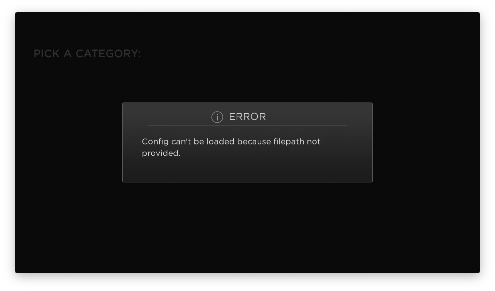
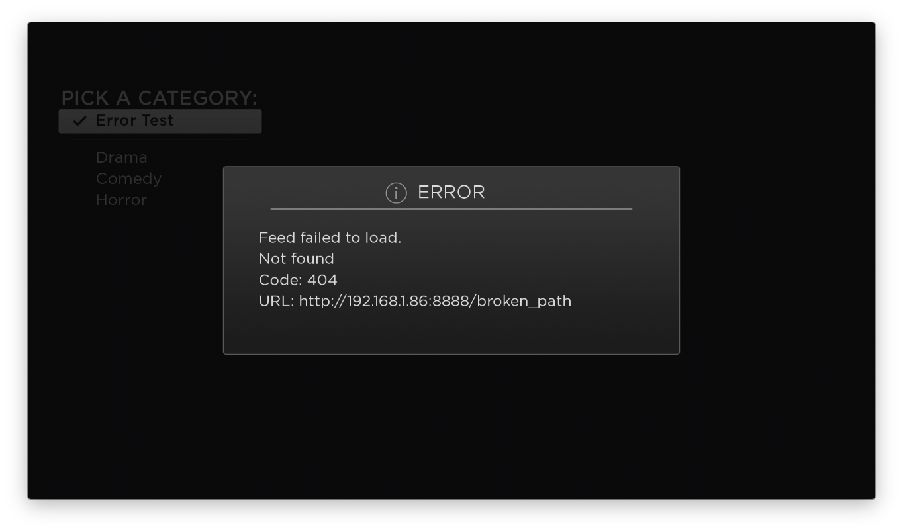
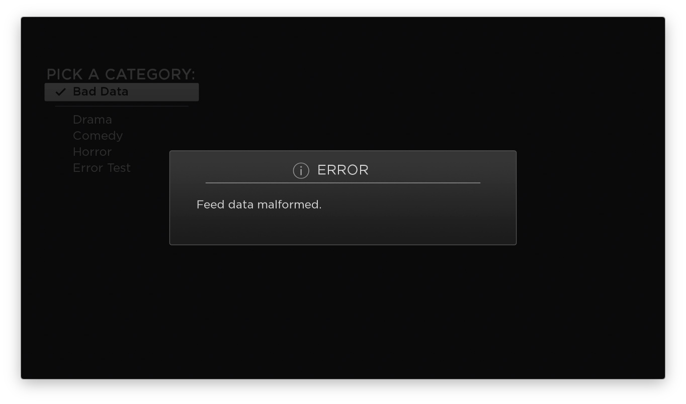

#  Lesson 7
## External Configuration, Interface Functions, Regular Expressions
At this point, we have a fully functional Roku video application.  The final lesson will to add a few improvements. We will move the feed data outside the application logic and into a local file, tweak the network requests with a regular expression, and improve the error handling.
OK, let's go:

1. Define a config file with the data needed by the categories screen. The host for the feeds and server is another value we don't want hardcoded into the application (it changed several times when authoring this course), so the config will include a property for that, too.  
Create a directory in the root of the application (alongside the manifest) called `resources` and inside it, add a file called `config.json` with the following contents:  

    ``` JSON
    {
      "host": "http://192.168.1.86:8888",
      "categories": [
        {
          "title": "Drama",
          "feed_url": "/roku_lessons/drama.json"
        },
        {
          "title": "Comedy",
          "feed_url": "/roku_lessons/comedy.json"
        },
        {
          "title": "Horror",
          "feed_url": "/roku_lessons/horror.json"
        }
      ]
    }

    ```

1. The pattern for loading a local file is similar to requesting files over the network. You must use a task. In the `components/tasks` directory, add a file `load_config_task.xml` with the following XML:  

    ``` xml
    <?xml version="1.0" encoding="utf-8" ?>
    <component name = "load_config_task" extends = "task" >
      <interface>
        <!-- input fields -->
        <field id = "filepath" type = "string" />
        <!-- response fields -->
        <field id = "filedata" type = "assocarray" />
      </interface>
      <script type="text/brightscript" uri="pkg:/components/tasks/load_config_task.brs"/>
    </component>
    ```

    Then create the companion `load_config_task.brs` file. Note the "pkg:/" prefix in the `ReadAsciiFile` call, this tells the Roku to look inside the app directory for the file.
    Read more about the Roku file system here:  
    https://sdkdocs.roku.com/display/sdkdoc/ifFileSystem  
    https://sdkdocs.roku.com/display/sdkdoc/Global+Utility+Functions#GlobalUtilityFunctions-ReadAsciiFile(filepathasString)asString

    ``` java
    sub init()
      m.top.functionname = "load"
    end sub

    function load()
        data=ReadAsciiFile("pkg:/"+m.top.filepath)
        ? "Config Data: ";data
        json = parseJSON(data)
        m.top.filedata = json
    end function

    ```
    This data is used by the category screen, so it may make sense to add code in `category_screen.brs` to use this task. However, I prefer to keep the load handling in the home scene to centralize the app logic. Furthermore, the `host` value will be used elsewhere in the app later on in this lesson.  
    Update `home_scene.brs` with a function called `loadConfig()`, and be sure to call it from the `init()` function :

    ``` java
    function init()
    	? "[home_scene] init"
    	m.category_screen = m.top.findNode("category_screen")
    	m.content_screen = m.top.findNode("content_screen")
    	m.details_screen = m.top.findNode("details_screen")
    	m.error_dialog = m.top.findNode("error_dialog")
    	m.videoplayer = m.top.findNode("videoplayer")
    	initializeVideoPlayer()

    	m.category_screen.observeField("category_selected", "onCategorySelected")
    	m.content_screen.observeField("content_selected", "onContentSelected")
    	m.details_screen.observeField("play_button_pressed", "onPlayButtonPressed")

    	m.category_screen.setFocus(true)
    	loadConfig()
    end function

    sub loadConfig()
        m.config_task = createObject("roSGNode", "load_config_task")
        m.config_task.observeField("filedata", "onConfigResponse")
        m.config_task.filepath = "resources/config.json"
        m.config_task.control="RUN"
    end sub  

    sub onConfigResponse(obj)
    	? "[Home Scene] Config Data: "; obj.getData()
    end sub
    ```

    Now the home scene will load the data from the external file. Run it an check the debugger.

1. The home scene should provide the loaded data to the category screen. This design creates an opportunity to use a **functional field**. Open `category_screen.xml` and add a `<function>` node to the `<interface>` node, and also remove the hardcoded data from the RadioButtonList:  

    ``` xml
    <?xml version="1.0" encoding="utf-8" ?>
    <component name="category_screen"
      extends="Group"
      >
      <script type="text/brightscript" uri="pkg:/components/screens/category_screen.brs" />
      <interface>
        <field id="category_selected"
    		    type="assocarray"
    		    alias="category_list.itemSelected"
            />
        <function name="updateConfig" />
      </interface>
      <children>
        <!-- color="0x000000" -->
        <Label
          translation="[75, 150]"
            id="env"
            font="font:LargeBoldSystemFont"
            text="PICK A CATEGORY:"/>
        <RadioButtonList
          id="category_list"
          translation="[100, 200]"
          itemSize="[400,48]"
        >
      </RadioButtonList>
      </children>
    </component>

    ```

    Go back to `home_scene.brs` and add the function call in the config response handler, and pay attention the `params` argument syntax required by this technique:  

    ``` java
    sub onConfigResponse(obj)
        params = {config:obj.getData()}
        m.category_screen.callFunc("updateConfig",params)
    end sub
    ```

    Now open `category_screen.brs` to implement the function, again paying attention to the argument syntax:    

    ``` java
    function updateConfig(params)
        categories = params.config.categories
        contentNode = createObject("roSGNode","ContentNode")
        for each category in categories
            node = createObject("roSGNode","category_node")
            node.title = category.title
            node.feed_url = params.config.host + category.feed_url
            contentNode.appendChild(node)
        end for
        m.category_list.content = contentNode
    end function
    ```

    Run the app and see if it works. Interface functions are your best bet to remain on familiar OOP ground when creating APIs for components.    
    Read more about functional fields here: https://sdkdocs.roku.com/display/sdkdoc/Handling+Application+Events#HandlingApplicationEvents-FunctionalFields

1. Now that the config is loading from a remote file, the application should gracefully handle errors. Open the `load_config_task.xml` file and add an "error" field:  

    ``` xml
    <?xml version="1.0" encoding="utf-8" ?>
    <component name = "load_config_task" extends = "task" >
      <interface>
        <!-- input fields -->
        <field id = "filepath" type = "string" />
        <!-- response fields -->
        <field id = "filedata" type = "assocarray" />
        <field id = "error" type = "string" />
      </interface>
      <script type="text/brightscript" uri="pkg:/components/tasks/load_config_task.brs"/>
    </component>
    ```

    In `load_config_task.brs`, put the field to use. First check to make sure the filepath was provided before the task runs, then validate the file response:  

    ``` java
    function load()
        if m.top.filepath = ""
            m.top.error = "Config can't be loaded because filepath not provided."
        else
    	    data=ReadAsciiFile("pkg:/"+m.top.filepath)
    	    ? "[Load Config Task] Data: "; data
    	    json = parseJSON(data)
    	    if json = invalid
    	        m.top.error = "File contents invalid."
    	    else
    	        m.top.filedata = json
    	    end if
    	end if
    end function
    ```

    Return to `home_scene.brs` and add the error handling:   

    ``` java
    sub loadConfig()
        m.config_task = createObject("roSGNode", "load_config_task")
        m.config_task.observeField("error", "onConfigError")
        m.config_task.observeField("filedata", "onConfigResponse")
        m.config_task.filepath = "resources/config.json"
        m.config_task.control="RUN"
    end sub

    sub onConfigError(obj)
    	showErrorDialog(obj.getData())
    end sub
    ```

    To exercise the error scenarios, delete the contents of the config or change the `filepath` value to a an empty string. The app will surface the error dialog:  
     

1. The feed loading needs error handling, as well. Open `load_feed_task.xml` and add an "error" field:  
    ``` XML
    <?xml version="1.0" encoding="utf-8" ?>
    <component name = "load_feed_task" extends = "task" >
      <interface>
        <!-- input fields -->
        <field id = "url" type = "string" />
        <!-- response fields -->
        <field id = "response" type = "string" />
        <field id = "error" type = "string" />
      </interface>
      <script type="text/brightscript" uri="pkg:/components/tasks/load_feed_task.brs"/>
    </component>
    ```

    Modify `load_feed_task.brs` to broadcast the error:  

    ``` java
    function request()
        url = m.top.url
        http = createObject("roUrlTransfer")
        http.RetainBodyOnError(true)
        port = createObject("roMessagePort")
        http.setPort(port)
        http.setCertificatesFile("common:/certs/ca-bundle.crt")
        http.InitClientCertificates()
        http.enablehostverification(false)
        http.enablepeerverification(false)
        http.setUrl(url)
        if http.AsyncGetToString() Then
          msg = wait(10000, port)
          if (type(msg) = "roUrlEvent")
            if (msg.getresponsecode() > 0 and  msg.getresponsecode() < 400)
              m.top.response = msg.getstring()
            else
              m.top.error = "Feed failed to load. "+ chr(10) +  msg.getfailurereason() + chr(10) + "Code: "+msg.getresponsecode().toStr()+ chr(10) + "URL: "+ m.top.url
            end if
            http.asynccancel()
          else if (msg = invalid)
            ?
            m.top.error = "Feed failed to load. Unknown reason."
            http.asynccancel()
          end if
        end if
        return 0
    end function
    ```

    Then update home_scene.brs to show an error dialog:

    ``` java
    sub loadFeed(url)
    	m.feed_task = createObject("roSGNode", "load_feed_task")
    	m.feed_task.observeField("response", "onFeedResponse")
    	m.feed_task.observeField("error", "onFeedError")
    	m.feed_task.url = url
    	m.feed_task.control = "RUN"
    end sub

    sub onFeedError(obj)
    	showErrorDialog(obj.getData())
    end sub
    ```

    To test the error handling, update the config file with a bogus category:  

    ``` JSON
    {
      "host": "http://192.168.1.86:8888",
      "categories": [
        {
          "title": "Drama",
          "feed_url": "/roku_lessons/drama.json"
        },
        {
          "title": "Comedy",
          "feed_url": "/roku_lessons/comedy.json"
        },
        {
          "title": "Horror",
          "feed_url": "/roku_lessons/horror.json"
        },
        {
          "title": "Error Test",
          "feed_url": "/broken_path"
        }
      ]
    }
    ```

    Run the app and select the Error Test category:  
    

1. There's one more error scenario to address.  If the feed data is not valid JSON, the app should handle it. To provide a bad feed, create a new file in `server/roku_lessons` and call it `bad_data.json`. Leave the contents of the file empty.

    Update the config file to add the Bad Data category:  

    ``` JSON
    {
      "host": "http://192.168.1.86:8888",
      "categories": [
        {
          "title": "Drama",
          "feed_url": "/roku_lessons/drama.json"
        },
        {
          "title": "Comedy",
          "feed_url": "/roku_lessons/comedy.json"
        },
        {
          "title": "Horror",
          "feed_url": "/roku_lessons/horror.json"
        },
        {
          "title": "Error Test",
          "feed_url": "/broken_path"
        },
        {
          "title": "Bad Data",
          "feed_url": "/roku_lessons/bad_data.json"
        }
      ]
    }
    ```
    Go to `home_scene.brs` and update the `onFeedResponse` function to handle the error:  

    ``` java
    sub onFeedResponse(obj)
    	response = obj.getData()
    	data = parseJSON(response)
    	if data <> invalid and data.items <> invalid
    		m.category_screen.visible = false
    		m.content_screen.visible = true
    		m.content_screen.feed_data = data
    	else
    		showErrorDialog("Feed data malformed.")
    	end if
    end sub
    ```

    Run the app and select "Bad Data" from the categories, you should see this:  
    

1. Now that the errors are covered, there is one more improvement to make. Right now the host address for each thumbnail is hardcoded into the feed data. But I want to use the `host` value from the config. This is a golden opportunity to demonstrate regular expression syntax in BrightScript.

    Open `home_scene.brs` and update the `onConfigResponse` method to pass the data to the content screen:  

    ```java
    sub onConfigResponse(obj)
    	params = {config:obj.getData()}
    	m.category_screen.callFunc("updateConfig",params)
    	m.content_screen.callFunc("updateConfig",params)
    end sub
    ```

    Add the functional field to  `content_screen.xml`:  

    ``` xml
    <interface>
      <field id="feed_data"
          type="assocarray"
          onChange="onFeedChanged"
          />
      <field id="content_selected"
          type="assocarray"
          alias="content_grid.itemSelected"
          />
      <function name="updateConfig" />
    </interface>
    ```

    Implement the function in `content_screen.brs`:  

    ``` java
    function updateConfig(params)
    	m.host = params.config.host
    end function
    ```

    Now for the fun part, update the feed parser in `content_screen.brs` to use a regular expression:  

    ``` java
    sub onFeedChanged(obj)
        feed = obj.getData()
        m.header.text = feed.title
        postercontent = createObject("roSGNode","ContentNode")
        regex = createObject("roRegEx", "http://[a-z0-9.:]+", "i")
        for each item in feed.items
            node = createObject("roSGNode","ContentNode")
            node.streamformat = item.streamformat
            node.title = item.title
            node.url = item.url
            node.description = item.description
            node.HDGRIDPOSTERURL = regex.replace(item.thumbnail,m.host)
            node.SHORTDESCRIPTIONLINE1 = item.title
            postercontent.appendChild(node)
        end for
        showpostergrid(postercontent)
    end sub
    ```
    The regex finds the string for the host (searching for everything before the first "/"), then replaces it with the `host` value from the config. Now the value used for loading feeds and thumbnails is centralized and easily updated.   
    More info: https://sdkdocs.roku.com/display/sdkdoc/ifRegex

That's it for this crash course on Roku Scenegraph. Thanks and good luck!
